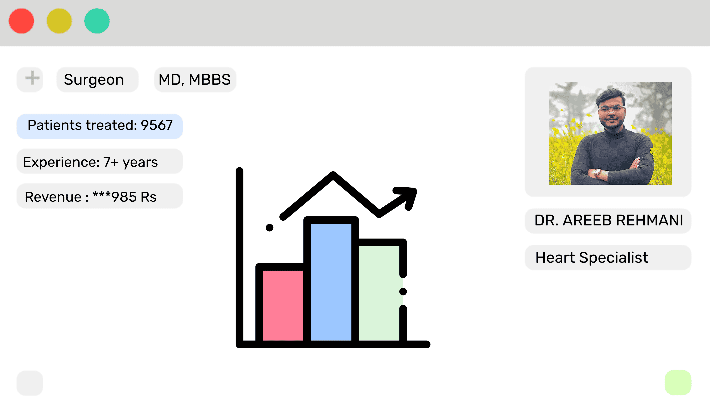

# Space-X Doctors - Healthcare Management Platform 🚀🩺



## Overview

Space-X Doctors is a modern, web-based platform designed to streamline interactions and operations within a healthcare ecosystem. It connects doctors, patients, chemists, and administrators, providing tools for efficient management of appointments, patient records, prescriptions, revenue, and more.

Built with React, TypeScript, and Material UI, it offers a responsive and intuitive user interface.

## ✨ Key Features

*   **Role-Based Access:** Dedicated interfaces and functionalities for Doctors, Patients, Chemists, and Administrators.
*   **Appointment Management:** Patients can book appointments, and doctors can manage their schedules.
*   **Patient Records:** Secure storage and access to patient information and history.
*   **Prescription Handling:** Doctors can issue prescriptions, and chemists can manage them.
*   **Revenue Tracking:** Tools for doctors and administrators to monitor daily, monthly, and custom revenue streams.
*   **Inventory Management (Chemist):** Tracking medical equipment, tests, and medicines.
*   **User Administration:** Admins can manage users and roles within the platform.
*   **Interactive Dashboard:** Visualizations and charts (using Chart.js) for key metrics like appointments, revenue, and patient numbers.
*   **Authentication:** Secure login and signup functionality with context-based authentication state management.
*   **Engaging UI:** Features particle animations (`tsparticles`) for a dynamic user experience.

## 💻 Tech Stack

*   **Frontend:** React, TypeScript
*   **UI Library:** Material UI (@mui/material)
*   **Routing:** React Router
*   **State Management:** React Context API (likely for AuthContext)
*   **API Communication:** Axios
*   **Charting:** Chart.js, react-chartjs-2
*   **Animations:** tsParticles, React Spring
*   **Development/Build:** Create React App (react-scripts), Webpack
*   **Component Library/Testing:** Storybook

## 🚀 Getting Started

### Prerequisites

*   Node.js and npm (or yarn) installed on your system.

### Installation & Running

1.  **Clone the repository:**
    ```bash
    git clone <your-repository-url>
    cd space-x-doctors
    ```
2.  **Install dependencies:**
    ```bash
    npm install
    ```
3.  **Run the development server:**
    ```bash
    npm start
    ```
    This will open the application in your default browser at [http://localhost:3000](http://localhost:3000).

## 🛠️ Available Scripts

*   `npm start`: Runs the app in development mode.
*   `npm run build`: Builds the app for production.
*   `npm test`: Runs the test suite.
*   `npm run storybook`: Starts the Storybook component library viewer.
*   `npm run build-storybook`: Builds the static Storybook site.
